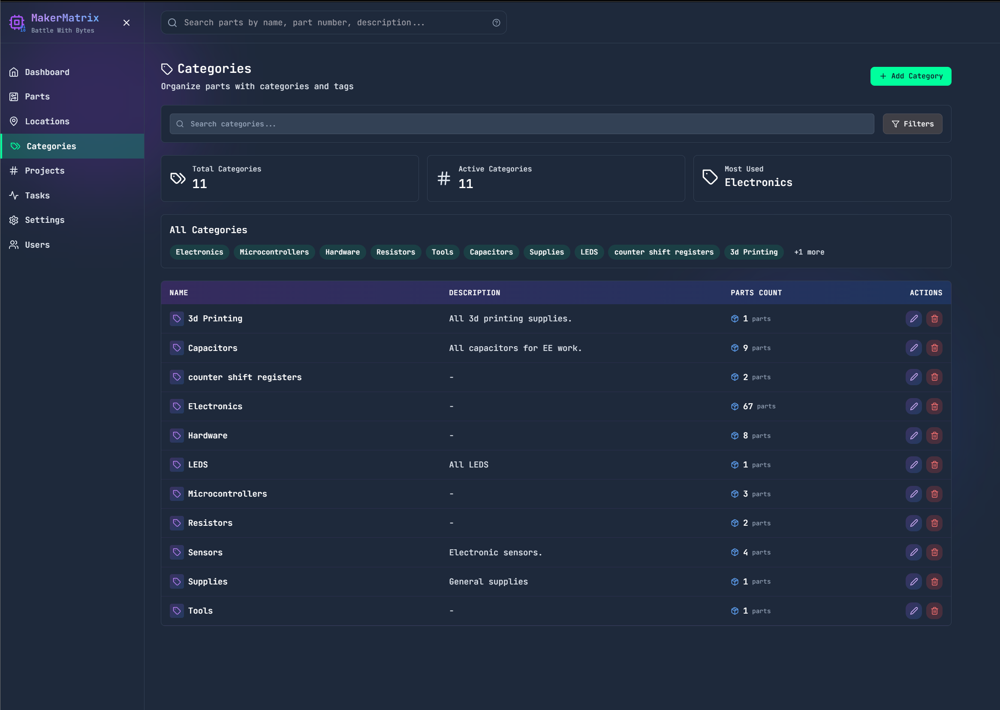
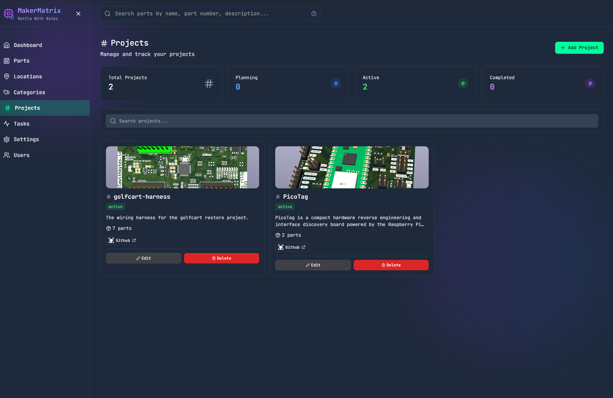
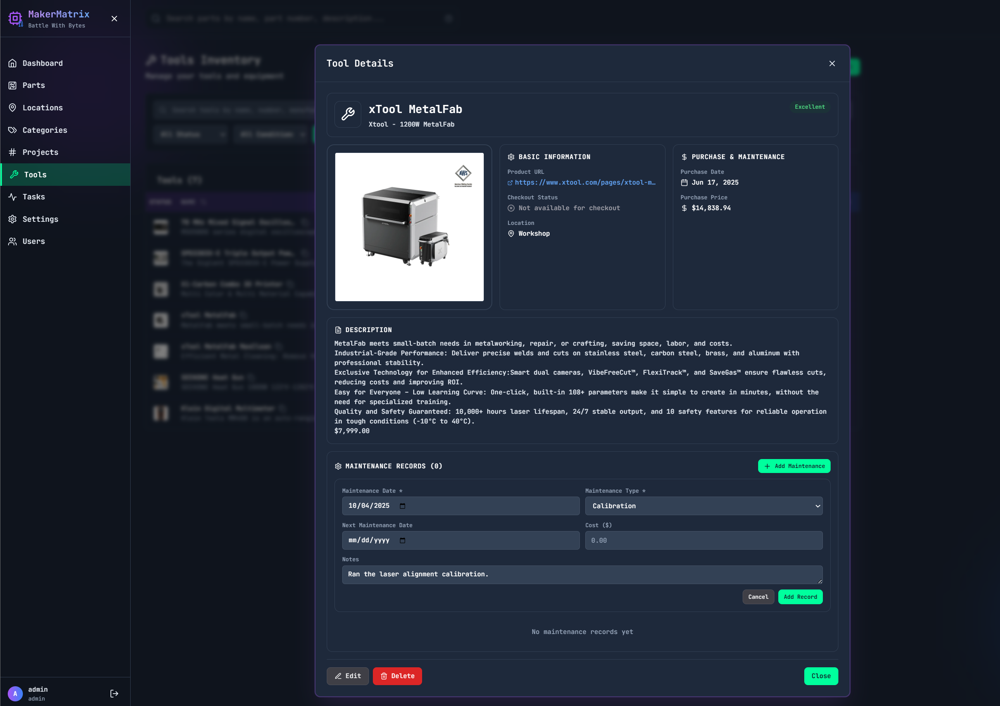
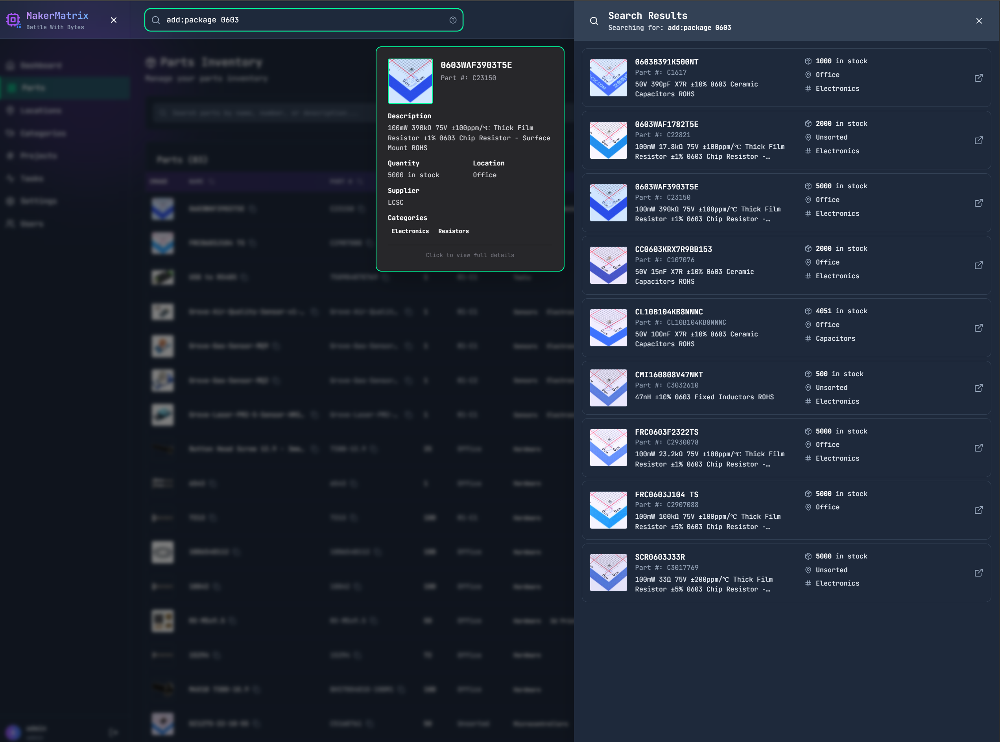
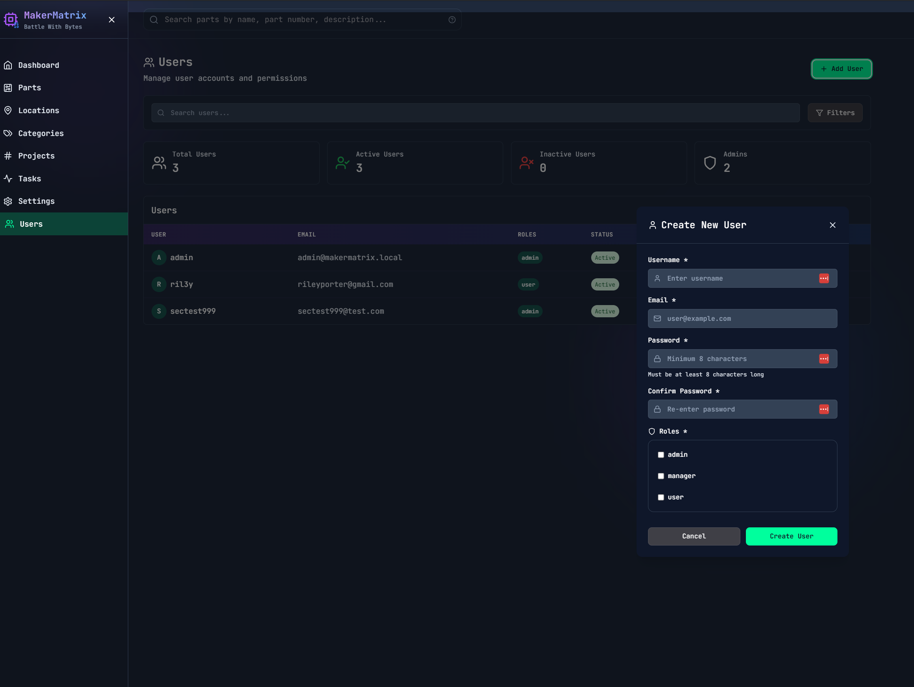

# MakerMatrix

**A powerful, modern electronic parts inventory management system designed for makers, engineers, and electronics enthusiasts.**

MakerMatrix helps you organize your electronic components, track tools and equipment, manage inventory across multiple storage locations, track projects, and automate part data enrichment from supplier APIs. Built with a modern tech stack (FastAPI + React + TypeScript), it provides a beautiful, responsive interface with real-time updates and powerful search capabilities.

<div align="center">


*Modern dashboard with real-time inventory statistics and analytics*

</div>

---

## ✨ Key Features

### 📦 Parts Management
Comprehensive part tracking with rich metadata, automatic supplier enrichment, and advanced search capabilities.


*Detailed part view with specifications, datasheets, images, and multi-location allocation tracking*

**Features:**
- **Rich Part Data**: Part numbers, descriptions, categories, specifications, datasheets, images
- **Multi-Location Allocation**: Track quantity across multiple storage locations with primary storage designation
- **Supplier Integration**: Automatic enrichment from LCSC, DigiKey, Mouser with real-time pricing and stock data
- **Advanced Search**: Field-specific search (name, description, part number) with support for additional properties (`prop:package 0603`)
- **QR Code Support**: Generate and print QR codes for quick part lookup
- **Project Association**: Link parts to projects with hashtag-style organization
- **Price Tracking**: Historical pricing data with analytics and trend visualization
- **Order History**: Complete order tracking with supplier information

### 📍 Location Management
Hierarchical storage organization with visual identification and container slot management.

<div align="center">


*Tree view of hierarchical storage locations with visual emojis*


*Advanced container slot management for organized storage*

</div>

**Features:**
- **Hierarchical Organization**: Multi-level location tree (e.g., Workshop → Shelf 1 → Drawer A → Bin 3)
- **Visual Identification**: Custom emojis or images for quick location recognition
- **Container Types**: Standard containers, cassette reels, single-part slots with auto-generation
- **Drag-and-Drop**: Reorganize locations with intuitive drag-and-drop (coming soon)
- **Path Tracking**: Full breadcrumb path from root to leaf locations
- **Deletion Safety**: Preview impact before deleting locations with orphaned part warnings

### 🗂️ Categories & Organization


*Flexible category system with part counts and quick filtering*

**Features:**
- **Flexible Categorization**: Organize parts by type (resistors, capacitors, ICs, etc.)
- **Part Counts**: Real-time counts of parts in each category
- **Multiple Categories**: Parts can belong to multiple categories
- **Quick Filtering**: One-click category-based part filtering

### 🔬 Projects Management


*Project tracking with status management and part associations*

**Features:**
- **Project Organization**: Group parts by project with status tracking (Planning, Active, Completed, Archived)
- **Many-to-Many**: Parts can belong to multiple projects
- **Visual Cards**: Project cards with images, descriptions, and custom links
- **Part Tracking**: See all parts associated with each project
- **Inline Assignment**: Add/remove project associations directly from part details

### 🔧 Tools Management
Comprehensive tool and equipment tracking with check-out/check-in, maintenance records, and multi-location support.

<div align="center">


*Tool inventory with status indicators and quick search*


*Detailed tool view with specifications, condition tracking, and location management*


*Complete maintenance history with service records and calibration tracking*

</div>

**Features:**
- **Tool Inventory**: Track hand tools, power tools, measuring instruments, and consumables
- **Check-Out System**: Check tools in/out with user tracking and expected return dates
- **Condition Tracking**: Monitor tool condition (excellent, good, fair, poor, needs repair, out of service)
- **Maintenance Records**: Complete maintenance history with service dates, types, costs, and notes
- **Calibration Management**: Track calibration-required tools with next calibration dates
- **Multi-Location Support**: Allocate tools across multiple storage locations
- **Tool-Specific Properties**: Custom properties for voltage, size, capacity, accuracy, etc.
- **Usage Tracking**: Monitor who has tools, when they were checked out, and expected return
- **Manufacturer Data**: Track manufacturer, model numbers, and supplier information
- **Visual Identification**: Tool images and emoji support for quick recognition
- **Value Tracking**: Purchase price, purchase date, and current value tracking
- **Consumable Support**: Special handling for consumable tools like drill bits and blades
- **Search & Filter**: Advanced search by tool name, manufacturer, model, or properties
- **Category Organization**: Assign tools to multiple categories for flexible organization

**Tool Types:**
- **Hand Tools**: Screwdrivers, pliers, wrenches, hammers
- **Power Tools**: Drills, saws, soldering stations, heat guns
- **Measuring Instruments**: Multimeters, calipers, oscilloscopes, scales
- **Consumables**: Drill bits, saw blades, sandpaper, tips

**Maintenance Types:**
- **Calibration**: Regular calibration for precision instruments
- **Repair**: Repair work and part replacements
- **Inspection**: Regular safety and operational inspections
- **Cleaning**: Deep cleaning and preventive maintenance
- **Other**: Custom maintenance types

### 🔍 Advanced Search


*Powerful search with field-specific syntax and JSON property searching*

**Search Syntax:**
- `"exact match"` - Find exact phrase (e.g., "5mm" won't match "1.5mm")
- `desc:capacitor` - Search description field only
- `pn:100k` - Search part number only
- `name:resistor` - Search part name only
- `prop:package 0603` - Search additional properties (also: `add:`)
- `resistor` - Search all standard fields

### 👥 User & Access Management


*Role-based access control with comprehensive user management*

**Features:**
- **Role-Based Access Control**: Admin, User, and custom roles
- **Permission System**: Granular permissions for parts, locations, categories, tasks
- **JWT Authentication**: Secure token-based authentication with refresh tokens
- **API Key Management**: Generate and manage API keys for programmatic access
- **Audit Logging**: Track user actions and changes

### 🏷️ Label Printing
Template-based label printing with QR codes for Brother QL printers.


*Template-based label printing with QR code support and real-time preview*

**Features:**
- **7 Pre-designed Templates**: Ready-to-use templates for common scenarios
- **Custom Templates**: Create and save your own label layouts
- **QR Code Generation**: Automatic QR codes with 8 positioning options
- **Variable Substitution**: Dynamic fields (part name, number, location, category, etc.)
- **Text Rotation**: 0°, 90°, 180°, 270° rotation support
- **Real-time Preview**: See your label before printing
- **Brother QL Support**: QL-800, QL-700, QL-570 printers (12mm, 29mm, 62mm, 102mm labels)

### 🔄 Real-Time Updates
WebSocket-based real-time updates keep your interface synchronized.

**Features:**
- **Task Progress**: Live updates during bulk operations and enrichment
- **Inventory Changes**: Real-time quantity updates across all views
- **System Notifications**: Instant alerts for errors and important events
- **Multi-User Support**: Changes from other users appear automatically

### 🤖 Task System
Background processing for long-running operations with progress tracking.

**Task Types:**
- **Part Enrichment**: Fetch details, datasheets, images from supplier APIs
- **Bulk Enrichment**: Process multiple parts in batch
- **File Import**: Import CSV/XLS order files from suppliers
- **Database Backup**: Comprehensive backup with datasheets and images
- **Price Updates**: Refresh pricing data from suppliers

### 💾 Database Backup & Restore
Comprehensive backup system with encryption support for data protection.

<div align="center">


*Encrypted backup management with password protection and scheduled backups*

</div>

**Features:**
- **Encrypted Backups**: Windows-compatible password-protected ZIP files (ZipCrypto)
- **Comprehensive Backup**: Includes database, datasheets, images, and environment configuration
- **Scheduled Backups**: Automatic nightly, weekly, or custom cron schedule backups
- **Retention Policy**: Automatic cleanup of old backups based on retention count
- **Progress Tracking**: Real-time progress updates during backup creation
- **Secure Password Handling**: Backend never sends passwords to frontend (boolean status only)
- **Quick Restore**: Easy restoration from encrypted or unencrypted backups
- **Backup Identification**: Visual indicators for encrypted vs unencrypted backups
- **Task-Based Architecture**: Background processing with WebSocket progress updates

### 📊 Analytics & Reporting
Built-in analytics with charts and data visualization.

**Features:**
- **Inventory Statistics**: Total parts, locations, categories with trends
- **Price Tracking**: Historical price data with line charts
- **Stock Levels**: Low stock alerts and inventory health metrics
- **Usage Patterns**: Most accessed parts and popular categories

---

## 🚀 Quick Start

### Prerequisites

**Required:**
- **Python 3.12+** (with pip)
- **Node.js 18+** (with npm)
- **Git** (for cloning the repository)

**Optional:**
- **OpenSSL** (for HTTPS certificates)
- **mkcert** (for locally-trusted HTTPS certificates - recommended)

### Installation

#### 1. Clone the Repository
```bash
git clone https://github.com/ril3y/MakerMatrix.git
cd MakerMatrix
```

#### 2. Set Up Python Environment
```bash
# Create virtual environment
python3 -m venv venv_test

# Activate virtual environment
source venv_test/bin/activate  # Linux/macOS
# or on Windows: venv_test\Scripts\activate

# Install Python dependencies
pip install -r requirements.txt
```

#### 3. Set Up Frontend Dependencies
```bash
cd MakerMatrix/frontend
npm install
cd ../..
```

#### 4. Configure Environment (Optional)

Create a `.env` file in the root directory for custom configuration:

```bash
# Copy the example file
cp .env.example .env
```

**Minimal .env configuration** (optional - has sensible defaults):
```bash
# Database (defaults to sqlite:///./makermatrix.db)
DATABASE_URL=sqlite:///./makermatrix.db

# Security (will auto-generate if not provided)
JWT_SECRET_KEY=your-secret-key-here

# Debug mode (optional)
DEBUG=False
LOG_LEVEL=INFO
```

**⚠️ Important:** The application will work without a `.env` file - it uses sensible defaults.

#### 5. Set Up HTTPS Certificates (Optional but Recommended)

**Option A - Quick Setup (Self-Signed):**
```bash
python scripts/setup_https.py
```

**Option B - Better Setup (No Browser Warnings):**
```bash
# First install mkcert: https://github.com/FiloSottile/mkcert#installation
# Then run:
python scripts/setup_https.py --method mkcert
```

**⚠️ Note:** HTTPS is **required** for DigiKey OAuth integration. For basic usage without supplier APIs, you can skip this step.

#### 6. Start the Application

**Using the Development Manager (Recommended):**
```bash
# Activate Python environment if not already active
source venv_test/bin/activate

# Start both backend and frontend
python dev_manager.py
```

The dev manager provides:
- 🎨 Rich terminal UI for managing services
- 🔄 Auto-restart on file changes (5-second debounce)
- 📊 Real-time log monitoring with color-coded output
- 🔒 HTTPS/HTTP mode switching (press `h`)
- 🔍 Process health monitoring
- 🌐 REST API on port 8765 for automation

**Keyboard Shortcuts:**
- `r` - Restart backend
- `f` - Restart frontend
- `b` - Restart both
- `h` - Toggle HTTPS/HTTP
- `l` - Toggle log filtering
- `c` - Clear logs
- `q` - Quit

**Manual Development (Alternative):**

If you prefer to run services separately:

```bash
# Terminal 1 - Backend
source venv_test/bin/activate
python -m MakerMatrix.main

# Terminal 2 - Frontend
cd MakerMatrix/frontend
npm run dev
```

### First Run - What Happens Automatically

On the first run, MakerMatrix automatically:

✅ **Creates the SQLite database** (`makermatrix.db`)
✅ **Initializes all database tables** with proper schema
✅ **Creates default roles** (admin, manager, user)
✅ **Creates default admin user** with credentials below
✅ **Sets up rate limiting** configuration
✅ **Initializes supplier integrations** (LCSC, DigiKey, Mouser, Seeed)
✅ **Configures CSV import** settings
✅ **Starts the task worker** for background jobs

**No manual database setup required!**

### Access the Application

After starting the development manager or manual services:

- **Frontend UI**: http://localhost:5173 (or https://localhost:5173 if HTTPS enabled)
- **Backend API**: http://localhost:8080
- **API Documentation**: http://localhost:8080/docs (Swagger UI)
- **Dev Manager API**: http://localhost:8765/docs (if using dev_manager.py)

### Default Credentials

**First-time login:**
- **Username**: `admin`
- **Password**: `Admin123!`
- **Email**: `admin@makermatrix.local`

**⚠️ IMPORTANT:** You will be prompted to change this password after first login!

### Quick Troubleshooting

**Port already in use:**
```bash
# Check what's using port 8080 (backend)
lsof -ti:8080 | xargs kill -9

# Check what's using port 5173 (frontend)
lsof -ti:5173 | xargs kill -9
```

**Import errors:**
```bash
# Make sure virtual environment is activated
source venv_test/bin/activate

# Reinstall dependencies
pip install -r requirements.txt --force-reinstall
```

**Frontend won't start:**
```bash
cd MakerMatrix/frontend
rm -rf node_modules package-lock.json
npm install
npm run dev
```

**Database issues:**
```bash
# The database is auto-created, but if you need to reset:
rm makermatrix.db
python -m MakerMatrix.main  # Will recreate on startup
```

### Dev Manager API (Automation)

The dev manager exposes a REST API for automation and CI/CD:

```bash
# Check service status
curl http://localhost:8765/status

# Restart backend
curl -X POST http://localhost:8765/backend/restart

# Get recent logs
curl "http://localhost:8765/logs?service=all&limit=100"

# Switch to HTTPS mode
curl -X POST http://localhost:8765/mode -H "Content-Type: application/json" -d '{"https": true}'
```

---

## 🛠️ Technology Stack

### Backend
- **FastAPI** - Modern, fast Python web framework with automatic OpenAPI docs
- **SQLAlchemy** - Powerful ORM with SQLite/PostgreSQL/MySQL support
- **SQLModel** - Combines SQLAlchemy and Pydantic for type-safe database models
- **Pydantic** - Data validation with Python type hints
- **JWT** - Secure authentication with refresh token pattern
- **WebSockets** - Real-time bidirectional communication
- **Async/Await** - High-performance async request handling
- **Background Tasks** - Queue-based task processing with progress tracking

### Frontend
- **React 18** - Modern UI library with hooks and concurrent rendering
- **TypeScript** - Type-safe JavaScript with excellent IDE support
- **Vite** - Lightning-fast build tool and dev server
- **TailwindCSS** - Utility-first CSS framework
- **Chart.js** - Beautiful, responsive charts
- **Framer Motion** - Smooth animations and transitions
- **React Router** - Client-side routing
- **WebSocket Client** - Real-time updates integration

### Database
- **SQLite** (default) - Zero-configuration embedded database
- **PostgreSQL** (optional) - Production-grade relational database
- **MySQL** (optional) - Alternative RDBMS option
- **Auto-migrations** - Automatic schema updates
- **Soft deletes** - Safe data deletion with recovery options

### Development Tools
- **dev_manager.py** - Rich TUI for integrated development
- **pytest** - Backend testing framework
- **Playwright** - Frontend E2E testing
- **ESLint** - JavaScript/TypeScript linting
- **Prettier** - Code formatting

---

## 📊 Supplier Integration

MakerMatrix integrates with major electronics suppliers for automated part enrichment.

### Supported Suppliers

| Supplier | Features | Status |
|----------|----------|--------|
| **LCSC Electronics** | Part details, pricing, datasheets, order import | ✅ Active |
| **DigiKey** | Part enrichment, OAuth2, pricing, stock | ✅ Active |
| **Mouser Electronics** | Order import, part enrichment, search | ✅ Active |
| **Seeed Studio** | Part details, specifications, datasheets | ✅ Active |

### Configuration

Add supplier credentials to `.env`:

```bash
# DigiKey OAuth2
DIGIKEY_CLIENT_ID=your_client_id
DIGIKEY_CLIENT_SECRET=your_secret
DIGIKEY_CLIENT_SANDBOX=False

# Mouser
MOUSER_API_KEY=your_api_key

# LCSC
LCSC_API_KEY=your_api_key
```

### Getting API Keys

**DigiKey:** Register at [DigiKey Developer Portal](https://developer.digikey.com/)
**Mouser:** Request access at [Mouser API Portal](https://www.mouser.com/api-signup/)
**LCSC:** Contact LCSC support for API access

---

## 📁 Project Structure

```
MakerMatrix/
├── dev_manager.py              # Development manager TUI
├── api.md                      # Complete API documentation
├── MakerMatrix/
│   ├── main.py                 # FastAPI application
│   ├── models/                 # Database models
│   │   ├── part_models.py
│   │   ├── location_models.py
│   │   ├── user_models.py
│   │   ├── tool_models.py
│   │   └── task_models.py
│   ├── repositories/           # Data access layer
│   ├── services/               # Business logic
│   │   ├── data/              # CRUD services
│   │   ├── system/            # System services
│   │   └── printer/           # Printer integration
│   ├── routers/                # API endpoints
│   ├── suppliers/              # Supplier integrations
│   │   ├── lcsc.py
│   │   ├── digikey.py
│   │   ├── mouser.py
│   │   └── seeed_studio.py
│   ├── tasks/                  # Background tasks
│   ├── frontend/               # React application
│   │   ├── src/
│   │   │   ├── components/    # React components
│   │   │   ├── pages/         # Page components
│   │   │   ├── services/      # API client
│   │   │   └── store/         # State management
│   │   └── public/
│   └── scripts/                # Utility scripts
├── tests/                      # Test suites
│   ├── unit_tests/
│   └── integration_tests/
├── docs/                       # Documentation
│   ├── guides/                # User guides
│   └── screenshots/           # UI screenshots
```

---

## 🧪 Testing

### Backend Tests
```bash
# Run all tests
pytest

# With coverage
pytest --cov=MakerMatrix

# Specific categories
pytest -m integration
pytest -m "not integration"
```

### Frontend Tests
```bash
cd MakerMatrix/frontend

# Unit tests
npm test

# E2E tests
npm run test:e2e

# All tests
npm run test:ci
```

---

## 📚 API Documentation

### Authentication
```bash
# Login
POST /api/auth/login
POST /api/auth/mobile-login

# Token management
POST /api/auth/refresh
POST /api/auth/logout
```

### Parts
```bash
# CRUD operations
GET    /api/parts/get_all_parts
POST   /api/parts/add_part
PUT    /api/parts/update_part/{id}
DELETE /api/parts/delete_part

# Search
POST   /api/parts/search
GET    /api/parts/search_text?query=resistor
GET    /api/parts/suggestions?query=res
```

### Locations
```bash
# Hierarchy management
GET    /api/locations/get_all_locations
POST   /api/locations/add_location
PUT    /api/locations/update_location/{id}
DELETE /api/locations/delete_location/{id}

# Navigation
GET    /api/locations/get_location_path/{id}
GET    /api/locations/get_location_details/{id}

# Container slots
POST   /api/locations/generate-container-slots
```

### Part Allocations
```bash
# Multi-location inventory
GET    /api/parts/{id}/allocations
POST   /api/parts/{id}/allocations
POST   /api/parts/{id}/transfer
POST   /api/parts/{id}/allocations/{id}/return_to_primary
```

### Tools
```bash
# CRUD operations
GET    /api/tools/
POST   /api/tools/
PUT    /api/tools/{id}
DELETE /api/tools/{id}
GET    /api/tools/{id}

# Search & filter
GET    /api/tools/search?query=drill
GET    /api/tools/available    # Get available tools
GET    /api/tools/checked_out  # Get checked out tools

# Check-out management
POST   /api/tools/{id}/checkout
POST   /api/tools/{id}/return

# Allocations
GET    /api/tools/{id}/allocations
POST   /api/tools/{id}/allocations
PUT    /api/tools/{id}/allocations/{allocation_id}
DELETE /api/tools/{id}/allocations/{allocation_id}

# Maintenance records
GET    /api/tools/{id}/maintenance
POST   /api/tools/{id}/maintenance
PUT    /api/tools/{id}/maintenance/{record_id}
DELETE /api/tools/{id}/maintenance/{record_id}
```

### Tasks
```bash
# Quick task creation
POST   /api/tasks/quick/part_enrichment
POST   /api/tasks/quick/bulk_enrichment
POST   /api/tasks/quick/database_backup

# Task monitoring
GET    /api/tasks/
GET    /api/tasks/{id}
WS     /ws/tasks?token={jwt}
```

**Full API documentation:** http://localhost:8080/docs

---

## 🔧 Configuration

### Environment Variables

```bash
# Database
DATABASE_URL=sqlite:///makermatrix.db

# Server
PORT=8080
HOST=0.0.0.0

# Security
SECRET_KEY=your-secret-key-change-this
ACCESS_TOKEN_EXPIRE_MINUTES=1440

# Development
DEBUG=true
LOG_LEVEL=INFO

# Supplier APIs (optional)
DIGIKEY_CLIENT_ID=
DIGIKEY_CLIENT_SECRET=
MOUSER_API_KEY=
LCSC_API_KEY=
```

### HTTPS Setup

For production or DigiKey OAuth:

```bash
# Quick setup (self-signed)
python scripts/setup_https.py

# Better setup (no browser warnings)
python scripts/setup_https.py --method mkcert
```

---

## 🤝 Contributing

We welcome contributions! Here's how to get started:

1. **Fork the repository**
2. **Create a feature branch**: `git checkout -b feature/amazing-feature`
3. **Follow the architecture patterns**:
   - Use repositories for data access
   - Use services for business logic
   - Use routers for API endpoints
4. **Add tests** for new features
5. **Update documentation** (api.md when adding endpoints)
6. **Commit changes**: `git commit -m 'Add amazing feature'`
7. **Push to branch**: `git push origin feature/amazing-feature`
8. **Open a Pull Request**

### Development Guidelines

- **Use the dev manager** for consistent development experience
- **Follow TypeScript/Python type hints** for better IDE support
- **Write tests** for all new features
- **Update API docs** when adding endpoints
- **Never commit secrets** to the repository

---

## 📖 Additional Documentation

- **[Developer Guide](docs/guides/Developer.md)** - Technical insights and patterns
- **[API Reference](api.md)** - Complete API documentation
- **[HTTPS Setup](scripts/HTTPS_SETUP.md)** - SSL/TLS configuration
- **[Supplier Status](suppliers.md)** - Supplier integration details

---

## 📄 License

This project is for electronic parts inventory management. See LICENSE file for details.

---

## 🌟 Star History

If you find MakerMatrix useful, please consider giving it a star! ⭐

---

<div align="center">

**Built with ❤️ for makers and electronics enthusiasts**

[Report Bug](https://github.com/ril3y/MakerMatrix/issues) · [Request Feature](https://github.com/ril3y/MakerMatrix/issues) · [Documentation](https://github.com/ril3y/MakerMatrix/wiki)

</div>
