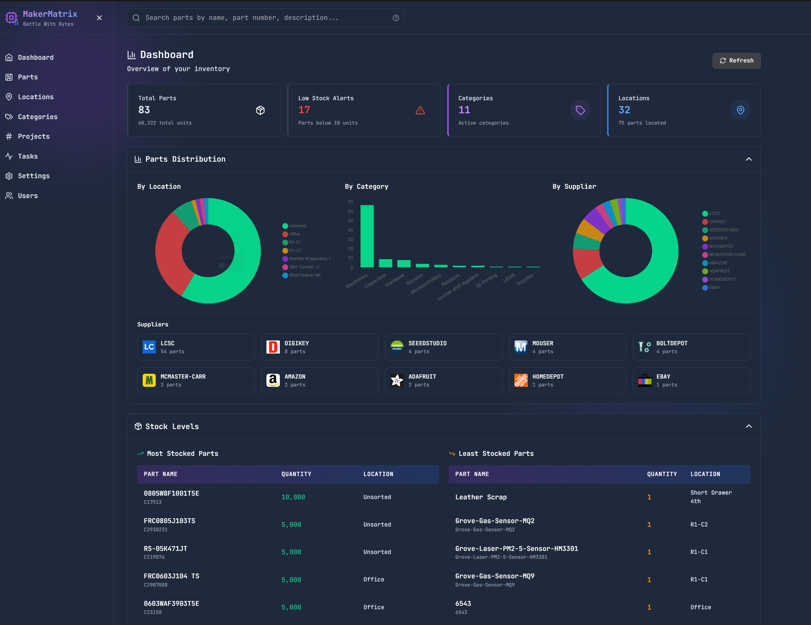
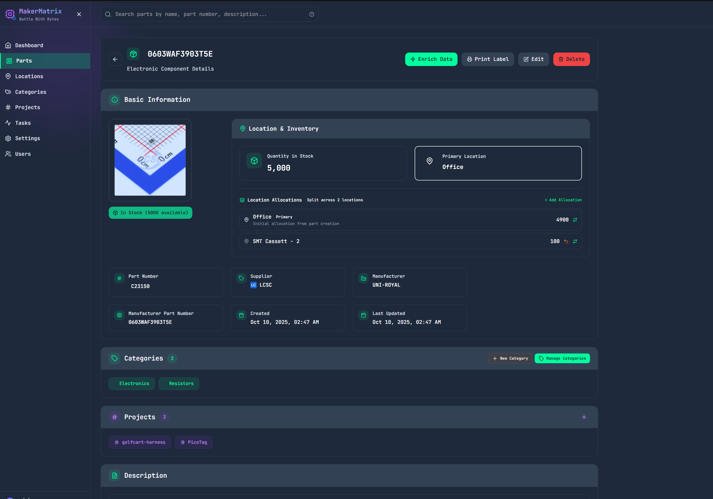

# MakerMatrix

**A powerful, modern electronic parts inventory management system designed for makers, engineers, and electronics enthusiasts.**


<div align="center">


*Modern dashboard with real-time inventory statistics and analytics*

</div>

---

## ✨ What is MakerMatrix?

MakerMatrix helps you **organize electronic components**, **track tools and equipment**, **manage inventory** across multiple storage locations, **track projects**, and **automate part data enrichment** from supplier APIs. Built with a modern tech stack (FastAPI + React + TypeScript), it provides a beautiful, responsive interface with real-time updates and powerful search capabilities.

### Key Highlights

- 📦 **Comprehensive Parts Management** - Rich metadata, multi-location tracking, automatic supplier enrichment
- 📍 **Hierarchical Storage** - Organize locations in a tree structure with container slot support
- 🔧 **Tools & Equipment Tracking** - Check-out/check-in system, maintenance records, calibration management
- 🏷️ **Smart Label Printing** - Template-based printing with QR codes for Brother QL printers
- 💾 **Automated Backups** - Encrypted backups with flexible scheduling (nightly/weekly/custom)
- 🔄 **Real-Time Updates** - WebSocket-based live synchronization across all users
- 🤖 **Supplier Integration** - Auto-enrich from DigiKey, Mouser, LCSC, Seeed Studio, Adafruit
- 🐳 **Docker Support** - Deploy anywhere with Docker or pull from GitHub Container Registry

---

## 🚀 Quick Start

### Option 1: Docker (Recommended)

Pull and run from GitHub Container Registry:

```bash
# Interactive quick-start
curl -sL https://raw.githubusercontent.com/ril3y/MakerMatrix/main/docker-run.sh | bash

# Or with Docker Compose
git clone https://github.com/ril3y/MakerMatrix.git
cd MakerMatrix
cp .env.example .env
docker-compose up -d
```

**Access at:** http://localhost:8080

### Option 2: Local Development

```bash
# Clone repository
git clone https://github.com/ril3y/MakerMatrix.git
cd MakerMatrix

# Set up Python environment
python3 -m venv venv_test
source venv_test/bin/activate
pip install -r requirements.txt

# Set up frontend
cd MakerMatrix/frontend && npm install && cd ../..

# Start with development manager
python dev_manager.py
```

**Access at:** http://localhost:5173

### Default Credentials

- **Username:** `admin`
- **Password:** `Admin123!`
- ⚠️ **Change immediately after first login!**

---

## 📚 Documentation

<table>
<tr>
<td width="50%">

### 📖 User Guides

- **[Installation Guide](docs/INSTALLATION.md)**
  Complete setup instructions for local and Docker deployments

- **[Features Guide](docs/FEATURES.md)**
  Comprehensive tour of all features and capabilities

- **[Configuration Guide](docs/CONFIGURATION.md)**
  Environment variables, HTTPS setup, supplier keys, and more

- **[Docker Deployment](DOCKER.md)**
  Container deployment, GitHub registry, and production setup

</td>
<td width="50%">

### 🛠️ Developer Resources

- **[Contributing Guide](CONTRIBUTING.md)**
  How to contribute code, architecture patterns, and testing

- **[API Reference](MakerMatrix/api.md)**
  Complete REST API documentation with examples

- **[HTTPS Setup Guide](scripts/HTTPS_SETUP.md)**
  SSL/TLS configuration for secure deployment

</td>
</tr>
</table>

---

## ✨ Feature Highlights

<details>
<summary><b>📦 Parts Management</b></summary>

- Rich part data with specifications, datasheets, images
- Multi-location allocation with primary storage
- Automatic enrichment from DigiKey, Mouser, LCSC
- Advanced search with field-specific syntax
- QR code generation and scanning
- Price tracking and order history
- Project association



</details>

<details>
<summary><b>📍 Location Management</b></summary>

- Hierarchical organization (Workshop → Shelf → Drawer → Bin)
- Visual identification with emojis and images
- Container types: standard, cassette reels, single-part slots
- Auto-generate slot sequences (A1-A10, 1-100)
- Drag-and-drop reorganization
- Deletion safety with impact preview


</details>

<details>
<summary><b>🔧 Tools Management</b></summary>

- Comprehensive tool inventory (hand tools, power tools, instruments)
- Check-out/check-in system with user tracking
- Condition monitoring and maintenance records
- Calibration tracking and alerts
- Multi-location support
- Usage history and statistics


</details>

<details>
<summary><b>🏷️ Label Printing</b></summary>

- Template-based printing with 7 pre-designed templates
- QR code generation with 8 positioning options
- Real-time preview before printing
- Brother QL-800 printer support (other QL models may work but are untested)
- 12mm label support (tested and verified)
- Custom template creation


</details>

<details>
<summary><b>💾 Backup & Restore</b></summary>

- Encrypted backups (Windows-compatible ZipCrypto)
- Comprehensive: database + datasheets + images + config
- Scheduled backups (nightly/weekly/custom cron)
- Retention policy with auto-cleanup
- Real-time progress tracking
- Quick restore with safety backup


</details>

<details>
<summary><b>🏷️ Tags System</b></summary>

- Instant tagging with `#tagname` syntax
- Consistent color coding (hash-based)
- Autocomplete from existing tags
- Multi-entity support (parts and tools)
- Workflow state tracking
- Project organization

</details>

**[See all features →](docs/FEATURES.md)**

---

## 🛠️ Technology Stack

<table>
<tr>
<td width="33%">

### Backend
- FastAPI
- SQLAlchemy + SQLModel
- Pydantic
- JWT Auth
- WebSockets
- APScheduler

</td>
<td width="33%">

### Frontend
- React 18 + TypeScript
- Vite
- TailwindCSS
- Chart.js
- Framer Motion
- React Router

</td>
<td width="33%">

### Infrastructure
- SQLite / PostgreSQL
- Docker + Docker Compose
- GitHub Actions CI/CD
- GitHub Container Registry
- Nginx / Traefik

</td>
</tr>
</table>

---

## 🐳 Docker Deployment

### Pull from GitHub Container Registry

```bash
# Latest stable
docker pull ghcr.io/ril3y/makermatrix:latest

# Specific version
docker pull ghcr.io/ril3y/makermatrix:v1.0.0

# Run
docker run -d -p 8080:8080 -v makermatrix-data:/data ghcr.io/ril3y/makermatrix:latest
```

### Available Tags

- `latest` - Latest stable release
- `main` - Latest development build
- `v1.0.0` - Specific version tags
- `sha-abc1234` - Commit-specific builds

**[Complete Docker Guide →](DOCKER.md)**

---

## 🔧 Configuration

### Environment Variables

```bash
# Security (REQUIRED)
JWT_SECRET_KEY=your-secure-random-key
ACCESS_TOKEN_EXPIRE_MINUTES=1440

# Database
DATABASE_URL=sqlite:///./makermatrix.db

# Supplier APIs (Optional)
DIGIKEY_CLIENT_ID=your-client-id
DIGIKEY_CLIENT_SECRET=your-client-secret
MOUSER_API_KEY=your-api-key
# Note: LCSC does not require an API key
```

**[Full Configuration Guide →](docs/CONFIGURATION.md)**

---

## 🤝 Contributing

We welcome contributions! Whether it's bug reports, feature requests, code contributions, or documentation improvements.

**Quick Start:**
1. Fork the repository
2. Create feature branch: `git checkout -b feature/amazing-feature`
3. Follow coding standards and add tests
4. Update documentation
5. Submit pull request

**[Contributing Guide →](CONTRIBUTING.md)**

---

## 📊 Project Status

| Component | Status |
|-----------|--------|
| Core Features | ✅ Stable |
| Code Quality | ✅ **100% Type Safe** (0 ESLint warnings, 0 TypeScript errors) |
| Docker Support | ✅ Production Ready |
| CI/CD Pipeline | ✅ Active |
| Backup System | ✅ Complete |
| Mobile App | 🚧 Planned |
| Multi-Warehouse | 🚧 Planned |

**Latest Release:** v1.0.0 - Complete code quality overhaul with perfect type safety

---

## 📄 License

This project is licensed under the MIT License - see the [LICENSE](LICENSE) file for details.

---

## 🌟 Star History

If you find MakerMatrix useful, please consider giving it a star! ⭐

[](https://star-history.com/#ril3y/MakerMatrix&Date)

---

<div align="center">

**Built with ❤️ for makers and electronics enthusiasts**

[🐛 Report Bug](https://github.com/ril3y/MakerMatrix/issues) · [✨ Request Feature](https://github.com/ril3y/MakerMatrix/issues) · [📖 Documentation](https://github.com/ril3y/MakerMatrix)

</div>
